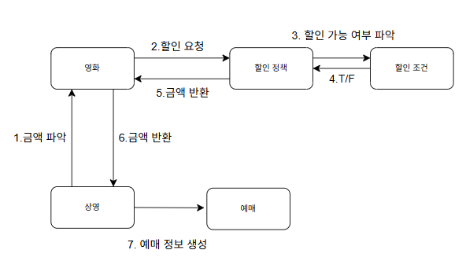

# 1. 요구사항 분석

## 주요 객체

- 영화
- 상영
- 할인조건
- 할인정책
- 예매

## 주요 객체의 속성

- 영화
    - 제목, 상영시간, 가격정보
- 상영
    - 상영일자, 시간, 순번
- 할인조건
    - 가격의 할인 여부를 결정한다.
    - 다수의 할인 조건을 함께 지정할 수 있고, 순서 조건과 기간조건을 섞는 것도 가능하다.
    - 기간조건과 순서조건이 존재한다.
- 할인정책
    - 할인 요금을 결정한다.
    - 할인 정책이 적용되어 있지 않으면 요금 할인은 없다.
    - 1인 기준으로 책정된다.
- 예매
    - 예매를 완료하면 예매정보를 생성한다.
    - 제목, 상영정보, 인원, 정가, 결제금액을 포함

## 초기 도메인 모델

